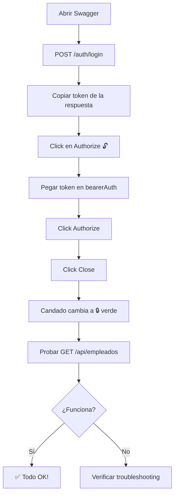

# 🔐 Guía: Cómo Usar Swagger con Autenticación JWT

## 🐛 Problema Detectado y Resuelto

**El problema:** Había una inconsistencia en el nombre del esquema de seguridad:
- OpenAPI Config usaba: `"Bearer Authentication"`
- Los controladores usaban: `"bearerAuth"`

**La solución:** Se unificó el nombre a `"bearerAuth"` en toda la aplicación.

---

## 📝 Paso a Paso para Autenticarse en Swagger

### 1️⃣ Acceder a Swagger UI

Abre tu navegador y ve a:
```
http://localhost:8080/swagger-ui.html
```

### 2️⃣ Hacer Login

1. **Busca el endpoint** `/auth/login` en la sección **Autenticación**
2. **Click en "Try it out"**
3. **Ingresa las credenciales:**
   ```json
   {
     "username": "admin",
     "password": "admin123"
   }
   ```
4. **Click en "Execute"**

### 3️⃣ Copiar el Token

La respuesta será algo como:
```json
{
  "token": "eyJhbGciOiJIUzI1NiIsInR5cCI6IkpXVCJ9.eyJzdWIiOiJhZG1pbiIsImlhdCI6MTYzMzAyNDgwMCwiZXhwIjoxNjMzMDUzNjAwfQ.abcd1234...",
  "refreshToken": "eyJhbGciOiJIUzI1NiIsInR5cCI6IkpXVCJ9...",
  "expiresIn": 28800000,
  "userInfo": {
    "id": 1,
    "username": "admin",
    "nombreCompleto": "Administrador Sistema",
    "rol": "PROPIETARIO",
    "empleadoId": 1
  }
}
```

**¡IMPORTANTE!** Copia SOLO el valor del campo `"token"` (sin las comillas)

### 4️⃣ Autorizar en Swagger

1. **Busca el botón "Authorize" 🔓** en la parte superior derecha de Swagger UI
2. **Click en "Authorize"**
3. Se abrirá un diálogo con el campo "bearerAuth"
4. **Pega el token** en el campo "Value"
   - ⚠️ **NO agregues "Bearer "** antes del token
   - ⚠️ Solo pega el token tal cual: `eyJhbGciOiJIUzI1NiIsInR5cCI6IkpXVCJ9...`
5. **Click en "Authorize"**
6. **Click en "Close"**

### 5️⃣ Probar los Endpoints Protegidos

Ahora puedes probar cualquier endpoint, por ejemplo:

1. **Ve a** `/api/empleados` (GET)
2. **Click en "Try it out"**
3. **Click en "Execute"**
4. ✅ **Deberías ver la lista de empleados**

---

## 🎯 Verificación Rápida

Para verificar que todo funciona:

### ✅ Antes de Autorizar
```
GET /api/empleados
❌ Status: 401 Unauthorized
{
  "path": "/api/empleados",
  "error": "Unauthorized",
  "message": "Token de acceso requerido",
  "status": 401
}
```

### ✅ Después de Autorizar
```
GET /api/empleados
✅ Status: 200 OK
{
  "content": [...],
  "totalElements": 2,
  "totalPages": 1,
  ...
}
```

---

## 🔄 El Token Expiró

Si después de un tiempo (8 horas) empiezas a recibir errores 401:

1. **Hacer logout:** Click en el candado 🔒 verde junto a "Authorize"
2. **Click en "Logout"**
3. **Repetir todo el proceso:** Login → Copiar token → Authorize

O puedes usar el endpoint `/auth/refresh` para renovar el token:
```json
POST /auth/refresh
{
  "refreshToken": "tu_refresh_token_aquí"
}
```

---

## 🎨 Interfaz de Swagger

### Iconos Importantes

| Icono | Significado |
|-------|-------------|
| 🔓 (candado abierto) | No estás autenticado |
| 🔒 (candado cerrado verde) | Estás autenticado correctamente |
| 🔒 (candado junto a endpoint) | Este endpoint requiere autenticación |

### Colores de los Métodos HTTP

- 🟢 **GET** - Verde (Leer datos)
- 🟡 **POST** - Amarillo (Crear)
- 🔵 **PUT** - Azul (Actualizar completo)
- 🟣 **PATCH** - Morado (Actualizar parcial)
- 🔴 **DELETE** - Rojo (Eliminar)

---

## 🚨 Troubleshooting

### Problema 1: "Token de acceso requerido"
**Solución:**
- ✅ Verifica que hiciste login
- ✅ Verifica que copiaste el token completo
- ✅ Verifica que autorizaste con el botón "Authorize"
- ✅ Verifica que NO agregaste "Bearer " antes del token

### Problema 2: "Token inválido o expirado"
**Solución:**
- ✅ Haz logout y vuelve a hacer login
- ✅ Verifica que el backend esté ejecutándose
- ✅ Verifica que el token no haya expirado (8 horas)

### Problema 3: "Forbidden - No tienes permisos"
**Solución:**
- ✅ Verifica que estás usando el usuario correcto
- ✅ Usuario `admin` tiene rol `PROPIETARIO` (todos los permisos)
- ✅ Usuario `tecnico` tiene rol `TECNICO` (permisos limitados)

### Problema 4: El botón "Authorize" no aparece
**Solución:**
- ✅ Reinicia el backend
- ✅ Limpia la caché del navegador (Ctrl + F5)
- ✅ Verifica que accediste a `/swagger-ui.html` no a `/swagger-ui/`

---

## 👥 Usuarios de Prueba

El sistema viene con 2 usuarios pre-cargados:

### Usuario Propietario (Todos los permisos)
```json
{
  "username": "admin",
  "password": "admin123"
}
```
- ✅ Puede crear, editar, eliminar empleados
- ✅ Puede crear, editar, eliminar tipos
- ✅ Puede gestionar usuarios
- ✅ Acceso completo al sistema

### Usuario Técnico (Permisos limitados)
```json
{
  "username": "tecnico",
  "password": "tecnico123"
}
```
- ✅ Puede ver su perfil
- ✅ Puede cambiar su contraseña
- ❌ No puede gestionar empleados
- ❌ No puede gestionar tipos
- ❌ No puede gestionar usuarios

---

## 📊 Endpoints por Rol

### Público (Sin autenticación)
- `POST /auth/login` - Iniciar sesión
- `POST /auth/refresh` - Renovar token
- `/swagger-ui.html` - Documentación

### Autenticado (Cualquier usuario)
- `GET /api/usuarios/mi-perfil` - Ver mi perfil
- `PATCH /api/usuarios/cambiar-mi-password` - Cambiar mi contraseña
- `GET /auth/validate` - Validar token

### PROPIETARIO (Solo admin)
- `POST /api/empleados` - Crear empleado
- `PUT /api/empleados/{id}` - Actualizar empleado
- `DELETE /api/empleados/{id}` - Eliminar empleado
- `POST /api/tipos-persona` - Crear tipo persona
- `POST /api/tipos-empleado` - Crear tipo empleado
- `POST /api/tipos-documento` - Crear tipo documento
- `POST /api/usuarios` - Crear usuario

### PROPIETARIO o ADMINISTRATIVO
- `GET /api/empleados` - Listar empleados
- `GET /api/empleados/{id}` - Ver empleado
- `GET /api/tipos-persona` - Listar tipos persona
- `GET /api/tipos-empleado` - Listar tipos empleado
- `GET /api/tipos-documento` - Listar tipos documento
- `GET /api/usuarios` - Listar usuarios

---

## 🔍 Ejemplo Completo de Flujo



---

## 💡 Tips Útiles

### 1. Mantener la Sesión Activa
- El token dura **8 horas** en desarrollo
- Si trabajas más de 8 horas, necesitarás re-autenticarte
- Usa el refresh token para extender la sesión

### 2. Testing de Permisos
Para testear diferentes permisos:
1. Haz login con `admin` (PROPIETARIO)
2. Prueba todos los endpoints ✅
3. Haz logout
4. Haz login con `tecnico` (TECNICO)
5. Intenta acceder a endpoints restringidos ❌

### 3. Copiar/Pegar Tokens
- Usa Ctrl+A para seleccionar todo el token
- No incluyas las comillas
- No incluyas espacios al inicio/final
- No agregues "Bearer " (Swagger lo hace automáticamente)

### 4. Múltiples Ventanas
- Puedes abrir múltiples pestañas de Swagger
- Cada pestaña mantiene su propia sesión
- Útil para probar con diferentes usuarios simultáneamente

---

## 🛠️ Configuración Técnica

### OpenAPI Configuration (Ya está configurado)

```java
@Configuration
public class OpenApiConfig {
    @Bean
    public OpenAPI customOpenAPI() {
        return new OpenAPI()
                .addSecurityItem(new SecurityRequirement()
                    .addList("bearerAuth"))
                .components(new Components()
                    .addSecuritySchemes("bearerAuth", createAPIKeyScheme()));
    }

    private SecurityScheme createAPIKeyScheme() {
        return new SecurityScheme()
                .name("bearerAuth")
                .type(SecurityScheme.Type.HTTP)
                .bearerFormat("JWT")
                .scheme("bearer");
    }
}
```

### Controller Annotation (Ya está configurado)

```java
@RestController
@RequestMapping("/api/empleados")
@SecurityRequirement(name = "bearerAuth")  // ← Nombre debe coincidir
public class EmpleadoController {
    // ...
}
```

---

## 📚 Recursos Adicionales

- **Swagger UI Docs:** https://swagger.io/tools/swagger-ui/
- **JWT.io:** https://jwt.io/ (para decodificar tokens)
- **Spring Security Docs:** https://spring.io/guides/topicals/spring-security-architecture

---

## ✅ Checklist Final

Antes de reportar un problema, verifica:

- [ ] El backend está ejecutándose en el puerto 8080
- [ ] Accediste a http://localhost:8080/swagger-ui.html
- [ ] Hiciste login en `/auth/login`
- [ ] Copiaste el token completo (sin comillas)
- [ ] Clickeaste en "Authorize" 🔓
- [ ] Pegaste el token en "bearerAuth"
- [ ] Clickeaste "Authorize" y luego "Close"
- [ ] El candado cambió a verde 🔒
- [ ] Intentaste el endpoint nuevamente

Si todos los pasos están correctos y sigue sin funcionar, verifica los logs del backend para más detalles del error.

